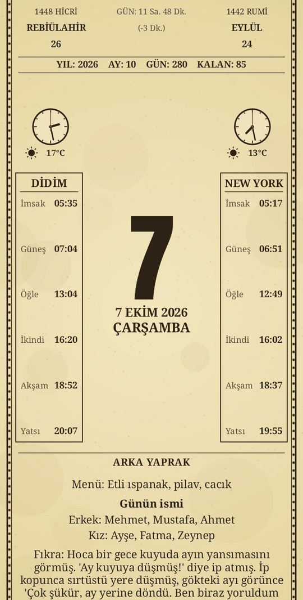
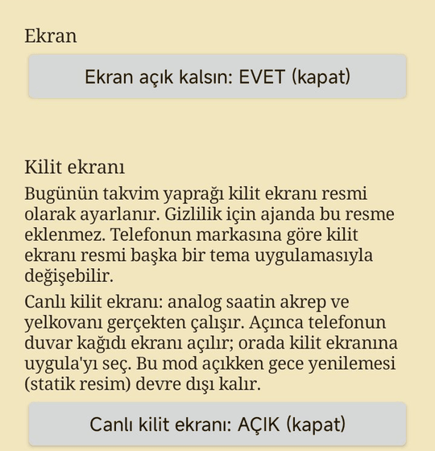

<h1 align="center">🕰️ Büyük Saatli Maarif Takvimi</h1>

  <b>Duvardaki yaprak takvim, şimdi telefonunda.</b> 
  Kilit ekranında çalışan analog saatler, namaz vakitleri, Hicri ve Rumi tarih. 📅

  
  
  

<table align="center">
  <tr>
    <td align="center"></td>
    <td align="center"></td>
  </tr>
  <tr>
    <td align="center">📜 Bugünün yaprağı</td>
    <td align="center">⚙️ Ayarlar</td>
  </tr>
</table>

## 🌟 Nedir bu?

Çocukluğumuzun evlerinde duvarda asılı duran, her sabah bir yaprağı koparılan **büyük saatli maarif takvimini** hatırlarsın. İşte o, telefonda.

Her gün yeni bir yaprak: bugünün tarihi, iki şehrin saati, havası ve namaz vakitleri. Yaprağın arkasında da günün menüsü, bugün doğanlara isim önerileri, bir bilmece ya da fıkra. Yaprağı **kilit ekranına** koyabilirsin, saatlerin akrebi, yelkovanı ve kırmızı saniye kolu gerçekten çalışır. ⏰

> 🚧 **İlk sürüm.** Şimdilik tek bir telefon modelinde denendi. Senin telefonunda farklı davranırsa, özellikle kilit ekranında, [buradan haber ver](https://github.com/geceleriesen/maariftakvim/issues). 🙏

## 👋 Kim yaptı, neden?

Ben yazılımcı değilim. Sadece eski bir geleneği, her sabah bir yaprak koparıp günün tarihine, saatine ve vaktine bakmayı yaşatmak istedim. 🍂

Uygulamayı yapay zekâ (Claude) yardımıyla adım adım geliştirdim. Bu yüzden eksikleri ve hataları olabilir, hepsi iyi niyetle. Anlayışın ve fikirlerin için şimdiden teşekkürler. 🙏

💡 Aklında bir fikir ya da karşılaştığın bir sorun varsa [buradan yaz](https://github.com/geceleriesen/maariftakvim/issues). Yazılımcı olmana gerek yok, "şurada şöyle oldu" demen yeter. 🙂

## ⬇️ İndir ve kur

**👉 [MaarifTakvimi.apk dosyasını indir](https://github.com/geceleriesen/maariftakvim/releases/latest/download/MaarifTakvimi.apk)**

1. İndirdiğin dosyaya dokun. **"İzin ver"** de, Google "zararlı olabilir" derse **"Yine de yükle"**. Uygulama Play Store'da olmadığı için bu uyarı normal. 🙂
2. Uygulamayı aç ve **"Kilit ekranına koy"**a bas.
3. Açılan ekranda **"Uygula"**ya bas ve **kilit ekranını** seç. Bitti! 🎉

📖 **Adım adım, resimsiz ama sade bir rehber istersen: [Kullanma Kılavuzu](KILAVUZ.md).**

## 👆 Nasıl kullanılır?

_Ayrıntılar için: [📖 Kullanma Kılavuzu](KILAVUZ.md)_

| Ne yaparsan | Ne olur |
|---|---|
| 👆👆 Ekrana **çift dokun** | Yaprak çevrilir, arka yaprak görünür |
| ✋ Ekrana **uzun bas** | Ayarlar açılır (şehirler, ajanda, kilit ekranı) |
| 🔒 Telefonu kilitle | Yaprak kilit ekranında durur, saatler çalışır |

Tek dokunuş bir şey yapmaz, böylece ekran görüntüsü alırken yaprak yanlışlıkla dönmez. 😉

## ✨ Neler var?

- 📆 **Üç takvim bir arada:** Miladi, Hicri ve Rumi tarih.
- 🌍 **İki şehir:** her biri için canlı analog saat, hava durumu ve namaz vakitleri. Şehri adıyla ararsın, istersen birincisini telefon konumundan buldurursun.
- 🔄 **Arka yaprak:** günün menüsü, isim önerileri (erkek ve kız), bilmece ya da fıkra. Her gün değişir.
- 🔒 **Canlı kilit ekranı:** yaprak kilit ekranında, saatler gerçekten çalışır.
- 🗓️ **Ajanda (isteğe bağlı):** telefon takvimindeki sıradaki etkinlik görünür. Kilit ekranında gösterilmez.
- 📱 **Her ekrana uyum:** uzun ve kısa ekranlarda yerleşim kendini ayarlar.

## ❓ Sık sorulanlar

**Güvenli mi?**
Kaynak kodu bu sayfada açık, istediğin gibi inceleyebilirsin. Uygulama hesap, reklam ya da takip aracı içermez. Aşağıdaki [Gizlilik](#-gizlilik) bölümüne bak.

**Güncelleme nasıl olur?**
Şimdilik her sürümün imzası farklı. Yeni sürümü kurmadan önce eskisini sil, ayarların sıfırlanır.

**Kilit ekranında saatler takılıyor ya da duruyor.**
Telefonun pil tasarrufu uygulamayı kısıtlıyor olabilir. Ayarlar → Uygulamalar → Maarif Takvimi bölümünde **pil kısıtlamasını kapat** ve varsa **otomatik başlat**ı aç.

**Kilit ekranında yaprağı çeviremiyorum.**
Kilit ekranı dokunuş almıyor. Arka yaprağın tamamını uygulamayı açıp çift dokunarak görürsün. Ama arka yaprağın özeti kilit ekranındaki yaprağın alt kısmında da var.

**Namaz vakitleri resmî imsakiyeyle tutmuyor.**
Vakitler hesaplanıyor (Diyanet yöntemi, deneysel), resmî imsakiyeden birkaç dakika sapabilir. Hicri tarih de Diyanet takviminden bir gün farklı olabilir. İbadet vakitleri için resmî kaynağa bakmanı öneririm. 🕌

**Ana ekran widget'ı var mı?**
Basit bir sürümü var, yeni tasarıma uyarlanacak.

**iPhone için var mı?**
Hayır. iOS uygulamaların kilit ekranına canlı çizim yapmasına izin vermiyor, bu yüzden bu uygulamanın ana özelliği orada yapılamaz.

## 🔐 Gizlilik

- 🕌 **Namaz vakitleri:** [Aladhan](https://aladhan.com/prayer-times-api) servisinden aylık indirilir, cihazda saklanır. İnternet yokken son indirilen ay kullanılır.
- ⛅ **Hava durumu ve şehir arama:** [Open-Meteo](https://open-meteo.com/). Şehrin koordinatları bu servislere gönderilir. Otomatik konum açıksa telefonun son bilinen konumu kullanılır.
- 🗓️ **Ajanda:** telefonun takviminden yalnızca cihazda okunur, dışarı gönderilmez.
- Konum ve takvim izinleri **isteğe bağlıdır**. Vermezsen ilgili özellik çalışmaz, uygulama çalışmaya devam eder.
- Hesap, reklam ve analiz aracı **yoktur**.

## 🛠️ Geliştirenler için

- Android Studio ile aç ve derle (JDK 17, Android SDK 34, minimum Android 8.0).
- GitHub Actions her `push`'ta derler, testleri çalıştırır ve APK'yı **Releases** altına koyar.
- Kod yapısı için [ARCHITECTURE.md](ARCHITECTURE.md).
- Günlük içerik (menü, isim, bilmece, fıkra) bu depodaki kendi yazılmış metinlerdir. `assets/data.json`'a eklenen metinlerin telif durumunu kontrol et, başkasının telifli metnini ekleme.

## 📜 Lisans

Kaynak kod herkese açıktır ama **açık kaynak değildir**: [PolyForm Noncommercial 1.0.0](LICENSE).

- ✅ Kişisel kullanım, inceleme, değiştirme ve kâr amacı gütmeden paylaşma serbest (lisans metni ve bildirim satırı korunarak).
- ❌ Satmak, reklamlı ya da ücretli bir üründe kullanmak, başka bir adla pazarlamak gibi **ticari kullanım için izin gerekir**.

Anton yazı tipi (SIL OFL 1.1) ile AndroidX ve Glance kütüphaneleri (Apache 2.0) kendi lisanslarında kalır. Bu bir hukuki tavsiye değildir, bağlayıcı olan lisans metnidir.
